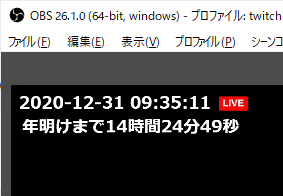

countdown clock
===============



配信画面に指定した期日までのカウントダウンをリアルタイムに表示します。

## 使い方
1. [zipファイルをダウンロードします](https://github.com/PRiMENON/countdown-clock/archive/master.zip)
1. 適当なフォルダに展開します
1. `clock.html` を OBS などの配信ソフトのブラウザソースとして開きます
1. 完了

## 初期設定
ゲーム画面を背景に表示すると、黒文字は見ずらいので白文字になっています。
そのために、何も表示されていないように見えます。

## カスタマイズ
### 期日を設定する
2021年6月23日12時25分までカウントダウンしたいとき。
```
later = DateTime.fromFormat('2021-01-01 00:00:00', 'yyyy-LL-dd HH:mm:ss');
👇
later = DateTime.fromFormat('2021-06-23 12:25:00', 'yyyy-LL-dd HH:mm:ss');
```

## 使用ライブラリ
luxon.js という時刻表示ライブラリを使用しています。
* [Luxon](https://moment.github.io/luxon/) - MIT License

## 動作確認ブラウザ

* Google Chrome
* Mozilla Firefox
* Microsoft Edge

## ライセンス
MIT License
